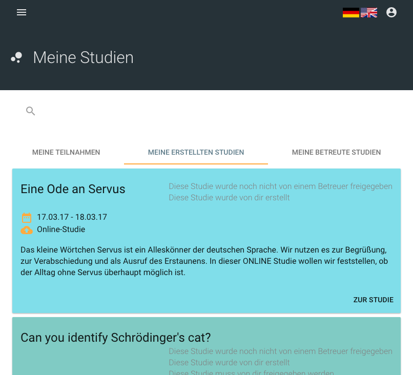
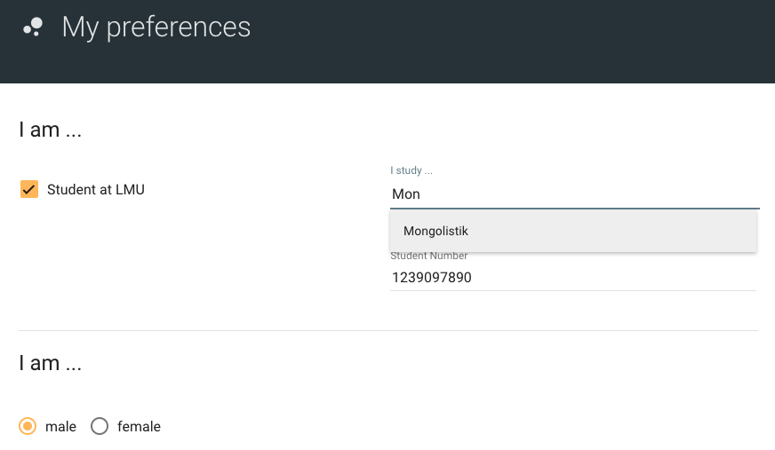
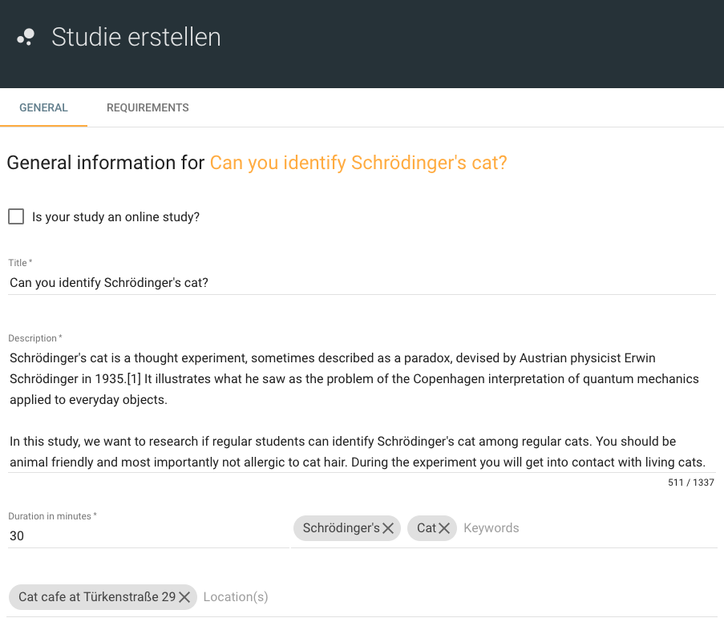
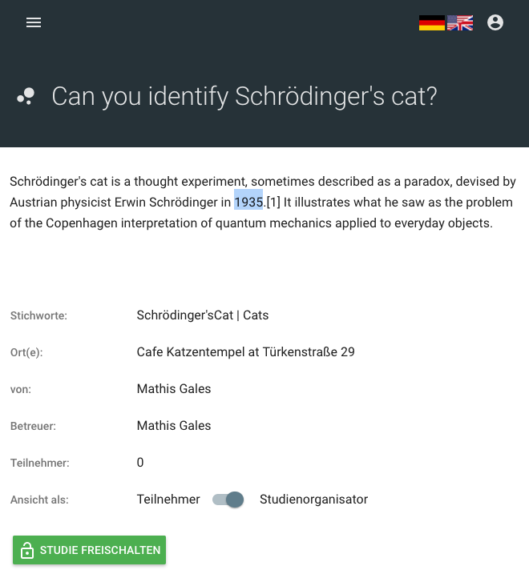

# Getting Started

The **Study List** is displayed after logging in for the first time, which shows all available studies for the user. Users can filter this list according to their wishes and click on a study will take them to the detail page of the respective study.

***

***

The user's relation to the study is indicated by color:
* **green:** the user is participating in this study and was confirmed by the study organizer
* **blue:** the user is participating in this study and was not yet confirmed
* ...

# Preferences

The user can specifiy details about himself on the preference page. These preferences are are used to filter studies accordingly. For isntance, a study requiring an android phone is not shown to a user who has specified that he has no such phone.

***

***

Note that only users who have their student number specified can choose experimental hours as a reward.

# Creating a new Study

All user's can create a new study by clicking the "Create Study"-Button. The subsequently appearing page consists of two tabs in which users can modify and adjust their study to their needs.

***

***

##### General Information
* General details about the study
    * Title
    * Description
    * Standard duration of one appointment
    * Keywords
    * All distinct locations of the study appointments
    * The supervisor of the study (needs to unlock the study)
* Possible rewards
* Adding appointments
    * Start time
    * Buffer between appointments (only used to increment start time after adding for convenience, not saved)
    * Date
    * Location
    * Maximumn number of participants
    * Deadline for registering (hours in advance)

##### Requirements

In this tab, requirements for participating in the study can be specified. These requirements are used to help showing the study to suiting applicants.

##### Online Study

Studies which are conducted online do not require appointments and rewards. By checking this box, a new input field for the URL of the study will appear, which is necessary for possible applicants to participate.

# Participating in a study

By clicking on a study in the list the user ist directied to the **Study Detail Page**, showing more detailed information about the study. Users can register for the study here.

##### Choosing a reward

To participate in a study the user needs to choose a reward, which is either Money, an Amazon gift card or experimental hours. Note that experimental hours can only be chosen if the user specified his student number in the preferences.

##### Applying for an appointment

Users can browse through appointments and apply for an appointment of their liking. After confirmation by the study organizer the user is registered for this specific appointment. The user might also be rejected by the study organizer.

##### Modifying the participation

* Users can withdraw their participation at any time until the deadline has passed, for instance to apply for another appointment.
* Users can change the chosen reward until the deadline has passed.

##### Contacting the study organizer

Users can contact the study organizer using the contact form at the bottom of the page.

# Managing a created study

The **Study Detail Page** shows additional imformation and provides additional options for the creator of the study. The creator can manage the participants and edit non-intrusive properties of the study

##### The creator of a study can 
* confirm or reject a participant prior to the participant's appointment
* confirm or deny the sucessful attendance of the participant at the appointment
* contact all participants using the contact form at the bottom of the page
* contact a specific participant by clicking on the participant's name

##### Additional Information

* Number of participants
* Gender distribution
* Details of a participant (A dialog is displayed when clicking on the participant's name)

##### Editing study details

Study organizers can edit some properties of the study as well as appointments, if the changes do not interfere with already registered participants.

# Supervising a study

* To prevent misuse, every newly created study needs to be unlocked by a supervisor.
* The supervisor can do so by clicking the "Unlock Study"-Button on the **Study Detail Page**.
* Studies are only eligible for participation if unlocked.
* Every supervisor is able to unlock a study, but only the supervisor specified in the study-creation process will be notified by email.

***

***

# Admin Dashboard

An Admin receives access to a dashboard, which allows him or her to grant admin status and supervisor status to a specific user.

